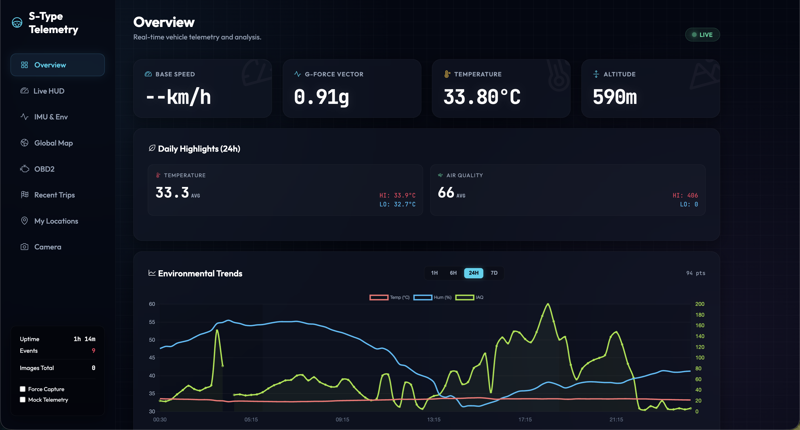

# 🏎️ S-Type Telemetry & Digital Cockpit

A premium, high-fidelity car telemetry and instrument cluster system designed for the Raspberry Pi. This project transforms a 2-inch ST7789V LCD into a modern "Digital Cockpit" while providing a performant web dashboard for historical analysis.



## ✨ Key Features

### 🖥️ Premium Digital Cockpit (LCD)
- **High-Fidelity UI**: Automotive-grade interface using the **Inter** font family with neon-accented gauges.
- **Dynamic HUD**: 
    - **Main View**: High-res speedometer, RPM, and engine vitals.
    - **Dynamics View**: Real-time G-Force tracker with lateral analytics.
- **Ambient Mode**: Automatically transitions to a comprehensive **Environmental Monitor** (AQI, Temp, Pressure, Elevation) when the engine is off.
- **Smart Adaptive UI**: Automatically skips pages for disconnected sensors (e.g., OBD, IMU).
- **Optimized Viewport**: 320x240 landscape rendering with software-based orientation to eliminate SPI noise.

### 📈 Historical Dashboard (Web)
- **Time-Bucketed Aggregation**: High-performance historical graphs (1h, 6h, 24h, 7d) using server-side SQL downsampling.
- **Day/Night Visualization**: Environmental charts automatically shade night-time segments (7 PM - 6 AM IST).
- **IST Synchronization**: Entire system is localized to **Indian Standard Time (Asia/Kolkata)**.
- **Interactive UX**: Visible data nodes and "Sticky Index" hovering for easy data inspection.

### 🛠️ Core Infrastructure
- **Always-On Persistence**: Full systemd integration for both telemetry and web services.
- **Modular Pollers**: Support for OBD2 (ELM327), GY-87 (MPU6050, BMP180), BME680, GPS, and Camera.
- **Efficient Storage**: SQLite database with Write-Ahead Logging (WAL) and optimized indexing.

## 🚀 Quick Start

### 1. Hardware Setup
- **Raspberry Pi** (Zero 2 W recommended).
- **ST7789V 2-inch LCD** (via SPI).
- **Sensors**: ELM327 (OBD2), GY-87, BME680, USB/CSI Camera.

### 2. Installation
```bash
# Clone the repository
git clone https://github.com/shubham9411/car-metrics.git
cd car-metrics

# Run the installer (sets up venv, dependencies, and fonts)
chmod +x install.sh
./install.sh
```

### 3. Service Management
The system is managed via systemd:
```bash
# Data Collection & LCD HUD
sudo systemctl status car-metrics

# Web Dashboard (8080)
sudo systemctl status car-metrics-web

# Restart all services
sudo systemctl restart car-metrics*
```

### 4. Local Deployment
If you are developing locally, use `deploy.sh` to sync changes to the Pi:
```bash
./deploy.sh
```

## 📂 Project Structure
- `pollers/`: Individual sensor drivers and logic.
- `web/`: Bottle-based server and Chart.js frontend.
- `storage/`: Database schema and aggregation logic.
- `assets/`: UI assets and premium typography.
- `scripts/`: System utilities and health healers.

---
*Created with ❤️ for the S-Type.*
